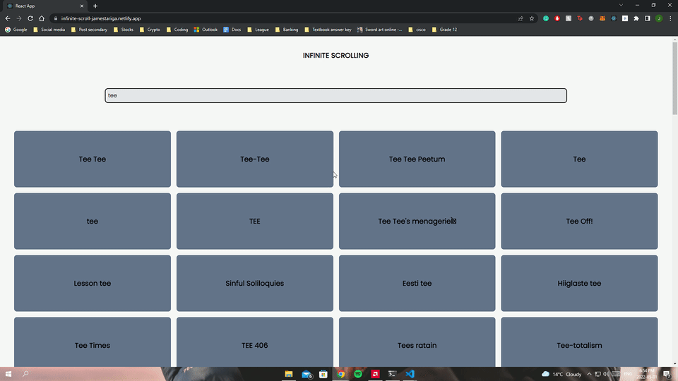
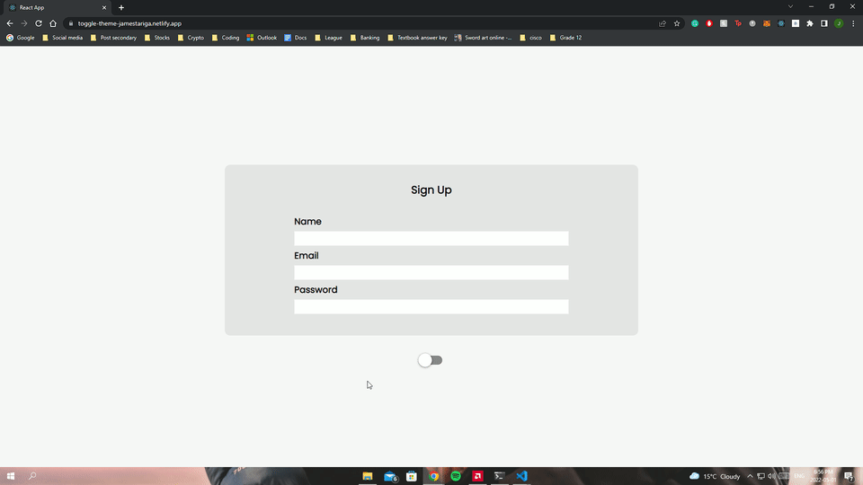
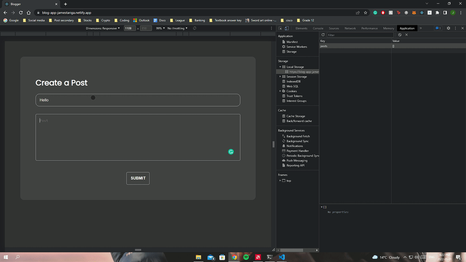
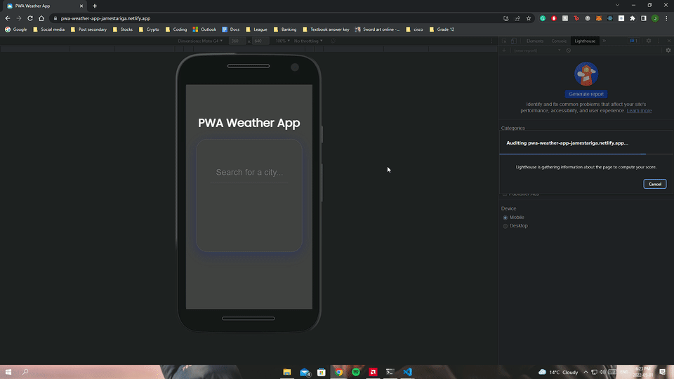
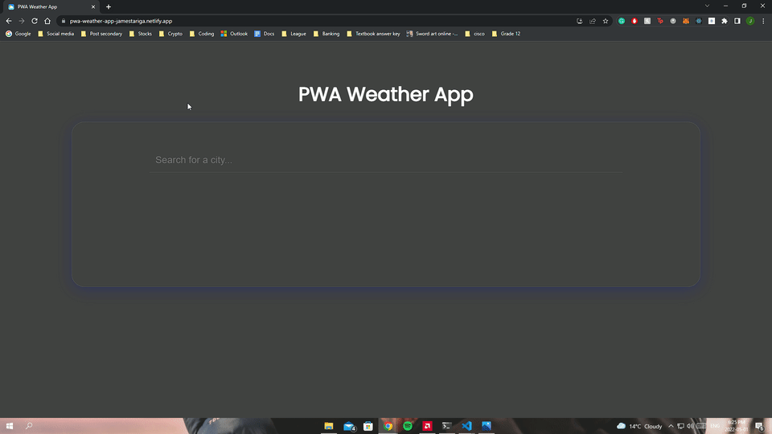
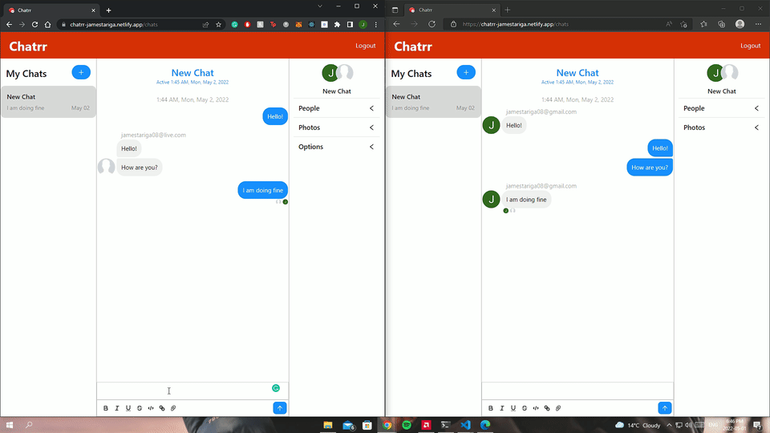
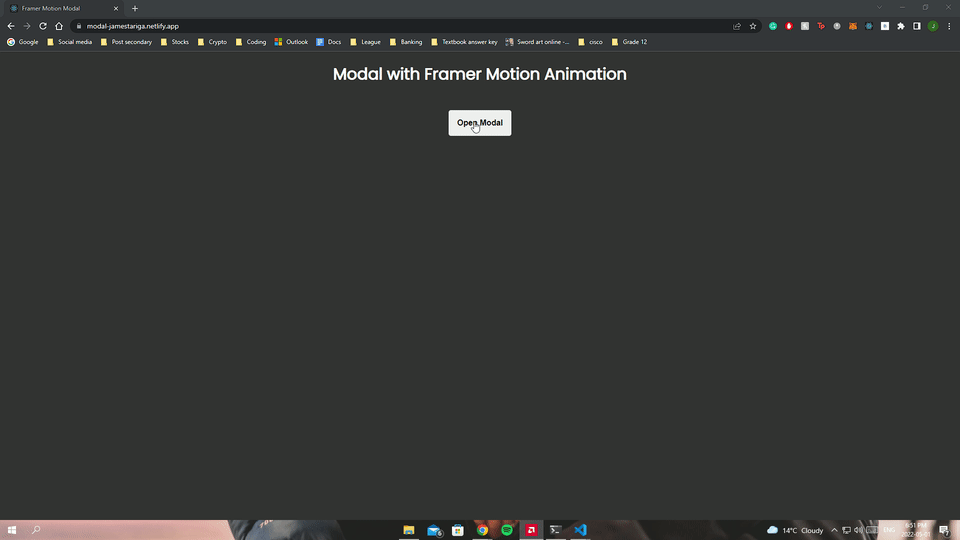

# 7 Days 7 React Projects

# About

This is a self improvement challenge for myself to solidify my knowledge of React. Within the final week of April 2022, I will create 7 react projects.

## Project 1: Infinite Scroll

This project is all about the implementation of the infinite scroll in React. The goal of this project is to successfully imitate Twitter's infinite scroll. With that said, this project is not a clone of any social media apps since this project only highlights the web-design technique.

Checkout the source code for this project [here](https://github.com/jamestariga/7-Days-7-React-Projects/tree/Infinite-Scroll) or visit the live [site](https://infinite-scroll-jamestariga.netlify.app/).

## Project 2: Toggle Theme (Light/Dark Mode)

This project is about the implementation of light and dark mode features in a React web app. My motivation for this project is to learn how this type of technique can be implemented in React.

Checkout the source code for this project [here](https://github.com/jamestariga/7-Days-7-React-Projects/tree/Toggle-Theme) or visit the live [site](https://toggle-theme-jamestariga.netlify.app/).

## Project 3: Content Filtering

This project is about implementing content filtering on a website. In this project, filtering is triggered when the user selects a specific genre from the drop-down menu. The API returns an array of genre IDs for every movie returned. The data is then filtered to check if the movie contains a specific genre using the includes() method. Only the objects with the specified genre ID will be displayed. Lastly, I added animations when the filtering occurs using Framer Motion.

Checkout the source code for this project [here](https://github.com/jamestariga/7-Days-7-React-Projects/tree/Content-Filter) or visit the live [site](https://movie-filter-jamestariga.netlify.app/).

## Project 4: Mini Blog App

This project is a mini-blog app where the user can create and delete a post. In this project, I learned how to implement state persistence in React using LocalStorage. This is the practice where the state is stored in the Local Storage of the browser. This method should only be used for smaller applications.

Checkout the source code for this project [here](https://github.com/jamestariga/7-Days-7-React-Projects/tree/Blog-App) or visit the live [site](https://blog-app-jamestariga.netlify.app/).

## Project 5: Progressive Web App (Weather App)

This application is my first progressive web app project. In this project, I learned how to build a PWA. The project is essentially just a simple weather app that can be installed locally.

Checkout the source code for this project [here](https://github.com/jamestariga/7-Days-7-React-Projects/tree/PWA-App) or visit the live [site](https://pwa-weather-app-jamestariga.netlify.app/).

## Project 6: Chat App

This project is my first full-stack application using React and Firebase. The project uses chatengine.io which is a web socket API. The application container user authentication using Firebase where users can then login to the chat app using their Google or Facebook account. Upon completing the authentication process, user can then make their chat room where they can invite people to join.

Checkout the source code for this project [here](https://github.com/jamestariga/react-chat-app) or visit the live [site](https://chatrr-jamestariga.netlify.app/).

## Project 7: Framer Motion Modal Animation

This is my final project for this challenge. In this project, I implemented framer motion to create a simple bouncing animation as the modal enters the DOM. Upon closing the modal, the modal will exit at the bottom of the screen.

Checkout the source code for this project [here](https://github.com/jamestariga/7-Days-7-React-Projects/tree/Modal) or visit the live [site](https://modal-jamestariga.netlify.app/).
